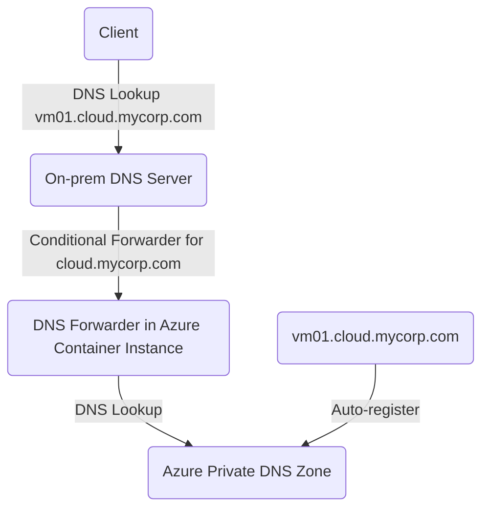

# Azure DNS Forwarder
## What's this?
[Azure Private DNS](https://learn.microsoft.com/en-us/azure/dns/private-dns-privatednszone) provides a secure DNS service to manage and resolve domain names in a virtual network without the need to add a custom DNS solution, and even allows you to [automatically register](https://learn.microsoft.com/en-us/azure/dns/private-dns-autoregistration) new Virtual Machines upon creation.

The records contained in a private DNS zone aren't resolvable from the Internet: DNS resolution against a private DNS zone works only from virtual networks that are linked to it. This means that your on-premises clients connected through VPN cannot resolve these names directly. This project proposes a (very) lightweight solution for this based on CoreDNS. 

When you have this container running on your Azure VNet, it will forward any incoming DNS request to Azure DNS and return the result to the caller. This allows your on-premises clients to resolve auto-registered VM names in Azure.





## How do I get this to work? 
1) Ensure you have an Azure VNet with a private DNS zone that is linked to the VNet, and a connection to your on-prem network. Deploy a machine to it for testing purposes. 
2) Build the container and push it to an Azure Container Registry
3) Create an Azure Container Instance running on the VNET in a subnet that is reachable from the on-premises network. Note its IP address. You should now be able to do lookups against it from the local network: ```dig @[container IP] vm01.cloud.mycorp.com```
4) Create a conditional forwarder on your on-premises DNS server to direct any lookups for *.cloud.mycorp.com to the container IP address. 